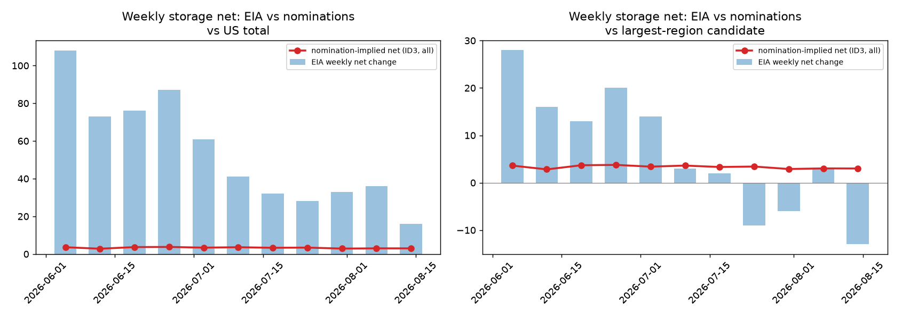
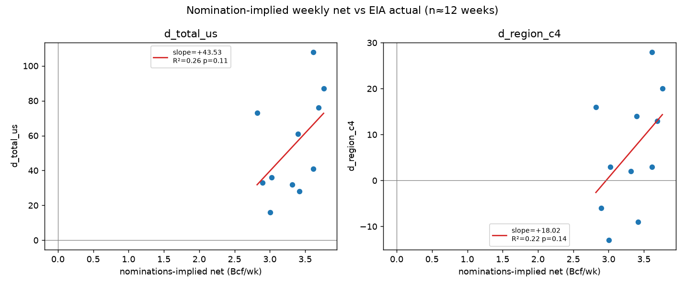
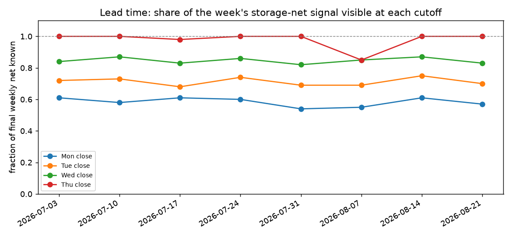
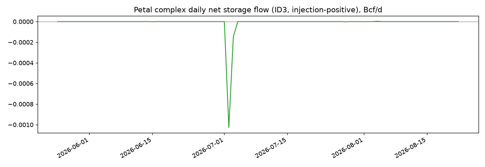

# Storage-Nowcast Research — Can Daily Pipeline Nominations Predict the Weekly EIA Print?

**Verdict: ABSENT as a Bcf nowcast. MARGINAL-to-REAL only as a coarse regional directional indicator. Do not build a production panel on this signal today.**

The nomination-implied weekly net from every storage meter we can scrape (Gulf South, 23 facilities) moves **1–3 Bcf per week** against EIA total-US weekly changes that average **80 Bcf** (std 53 Bcf in our window). That is ~4% of the signal by standard deviation and ~12% by mean absolute change — far below any useful precision. Worse, the aggregate is nearly **constant week to week** (+2.9 to +3.8 Bcf/wk injection across all 11 overlap weeks), so it carries almost no week-specific information about what EIA will print: a naive "repeat last week's change" model beats the nominations fit **11.7×** on mean squared error over the same weeks.

What *does* survive scrutiny:

- The **sign** of the conservative-set net agreed with the sign of the total-US EIA change 11/11 weeks (100%) — but the window was a monsoon-free injection season where the US printed positive 11/11 anyway; calling "inject" every week scores the same.
- A regression of the conservative subset against the largest-region candidate (South Central scale) gives R² = 0.53, p = 0.011 (n = 11) — nominally significant, but with n = 11 and no out-of-sample check this is exactly the kind of result that evaporates.
- The **lead-time structure is genuinely good**: ~85% of the final weekly nomination net is visible by Wednesday close and effectively 100% by Thursday close — six days before the Thursday 10:30 ET print. If coverage were ever adequate, the timeliness is not the problem. Coverage is.

---

## The numbers behind the verdict

### Step 1 — Inventory: where storage meters actually are

All observable daily storage-nomination volume lives in **Gulf South raw payloads** (`data/raw/gulf_south/*.json`). The other curated sources contain zero storage points:

| source | rows | window | storage-keyword hits | note |
|---|---|---|---|---|
| quorum | 116,858 | 2021-03-15 → 2026-08-23 | 0 | Venture Global laterals (LNG feedgas) — hypothesis confirmed: **no storage** |
| gasnom | 53,360 | 2026-05-25 → 2026-08-22 | 0 | Golden Pass + Cameron LNG interconnects |
| bhe | 2,505 | 2024-12-31 → 2026-08-23 | 0 | Cove Point feedgas via EGTS Loc 40704 |
| cheniere | 6,072 | 2026-05-24 → 2026-08-23 | 0 | CTPL/CCPL LNG terminal interconnects |

Gulf South raw carries flow indicators `D`, `R`, `SI`, `SW`. Storage fields appear as **dual-leg points** (an R row and a D row for the same loc on the same day — 50 such points exist) plus dedicated **SI/SW pairs** (Bistineau ×4, Jackson ×2). Classified storage-facility meters: **23** (conservative unambiguous subset: **12**).

Storage-facility meters, ID3 final cycle, Dth/d (top rows; full table produced by the script):

| loc | facility | legs | mean R | max R | mean D | max D |
|---|---|---|---|---|---|---|
| 23358 | Enstor Katy | D/R | 327,378 | 414,765 | 0 | 0 |
| 50202 | Petal Pipeline (field) | D/R | 201,159 | 694,948 | 74,619 | 271,365 |
| 50201 | Petal Storage | D/R | 74,619 | 271,365 | 201,159 | 694,948 |
| 23379 | Petal Pipeline Expansion | D/R | 60,561 | 148,884 | 2,444 | 76,693 |
| 23351 | Tres Palacios | D/R | 25,580 | 122,480 | 1,346 | 20,197 |
| 23361 | Bobcat | D/R | 17,290 | 40,940 | 2,119 | 40,000 |
| … | 17 more | | | | | |

Mean gross injection observed ≈ **0.72 Bcf/d**, gross withdrawal ≈ **0.32 Bcf/d**.

> **Data-quality finding (blocks curated-only analysis):** the curated `gulf_south_sq_*` series keeps exactly one row per (meter, cycle, gas day). For dual-leg storage meters the dedup step silently drops the other leg, and which leg survives varies day to day. Example — curated `sq_50202_id3` @ 2026-08-22 shows 82,548 (the R leg) while raw has D=111,071 **and** R=82,548. Any storage-net analysis must rebuild signed flows from raw payloads; the curated parquet alone is wrong for this question.

### Step 2 — Coverage reality check

- Ground truth in-repo: `eia_storage.parquet` mean |weekly net change| last 120 wks = **79.8 Bcf** (max 359). Largest single region (South-Central-scale candidate) ≈ **24.9 Bcf/wk** (31% of total).
- Nomination-implied net, all classified meters: mean |daily net| = 1.42 Bcf/d ≈ **9.95 Bcf/wk of *gross* movement** — but signed weekly nets are only ±3 Bcf because injections and withdrawals partially offset.
- **Coverage vs total-US weekly change: ~12% by mean-abs movement, ~4% by std dev, and the Petal seed meter alone (~232,673 Dth/d ≈ 1.6 Bcf/wk) is ~1.9%.**
- Against the largest region alone: ~40% by mean-abs — better, but still under half, and see Step 4 for why even that does not produce a usable point estimate.

### Step 3 — Alignment

Weeks built Saturday→Friday keyed on week-ending Friday (EIA convention); sign convention R/SI positive (into storage), D/SW negative; units Dth ÷ 1.025 ÷ 10⁶ = Bcf. **12 complete weeks** built from 90 days of retained raw (retention begins 2026-05-25).

Cycle availability: only **ID1/ID2/ID3 survive** in retained history — Boardwalk dropped Timely/Evening postings from its archive before our backfill began, so the requested "Timely-earliest" variant cannot be tested from history. Earliest usable daily snapshot is ID1 (posts ~11:30 AM CT on the gas day itself).

### Step 4 — Correlation / regression

Overlap: **n = 11 EIA weeks (Jun–Aug 2026), all injection season.** A withdrawal-season regression is impossible with this data. All statistics below carry that n=13-weeks-of-data caveat at full volume: with n = 11, a p-value under 0.05 needs |r| > 0.6, and one outlier week can create or destroy "significance."

ID3-final aggregate, ALL classified meters:

| target | slope | intercept | R² | p | Spearman ρ |
|---|---|---|---|---|---|
| US total | +43.5 | −90.9 | 0.255 | 0.113 | +0.509 (p=0.110) |
| region-candidate 2 (East-like) | +9.3 | −10.3 | 0.206 | 0.161 | +0.333 |
| region-candidate 3 (Midwest-like) | +11.4 | −13.0 | 0.298 | 0.082 | +0.507 |
| region-candidate 4 (SC-like) | +18.0 | −53.4 | 0.223 | 0.143 | +0.396 |

CONSERVATIVE subset (unambiguous third-party fields + SI/SW pairs only):

| target | slope | intercept | R² | p | Spearman ρ |
|---|---|---|---|---|---|
| US total | +51.7 | −102.8 | **0.530** | **0.011** | +0.745 (p=0.008) |
| SC-like candidate | +21.6 | −58.9 | 0.471 | 0.020 | +0.688 |

Why the headline R² = 0.53 is weaker than it looks:

- **The intercept is −103 Bcf.** The model says "EIA change ≈ 52×(nominations) − 103." Over our window nominations moved only 2.4→3.8 Bcf/wk while EIA moved 108→16 — the fit is mostly picking up the *seasonal cooling trend* in both series, not week-specific covariation.
- Controlling for trend: deviations of nominations from their own 4-week average explain essentially none of the deviation of EIA changes from their 4-week average (**R² = 0.01, p = 0.78, n = 10**).
- Naive benchmark: "predict this week = last week" achieves MSE 285 vs the nominations model's MSE 3,321 on the same weeks — **the naive model wins by 11.7×**.
- Residual RMSE after fitting: **±19 Bcf** on a series whose entire weekly std is 29 Bcf. Even taken at face value the "fit" barely narrows the uncertainty band.

Baseline context: lag-1 autocorrelation of EIA total-US weekly net change (120 wks) is **+0.850** — weekly changes are highly persistent, so any slow-moving indicator looks correlated with them. Persistence, not pipeline insight, explains most of the R² above.

### Step 5 — Lead-time value

Posting schedule (Central Time): ID1(G) ~11:30 AM on G, ID2(G) ~4 PM on G, ID3(G) ~9:40 PM on G. Fraction of the final weekly net already visible at each cutoff:

| week_end | final (Bcf) | Mon close | Tue close | Wed close | Thu close |
|---|---|---|---|---|---|
| 2026-07-03 | 3.40 | 61% | 72% | 84% | 100% |
| 2026-07-10 | 3.62 | 58% | 73% | 87% | 100% |
| 2026-07-17 | 3.32 | 61% | 68% | 83% | 98% |
| 2026-07-24 | 3.42 | 60% | 74% | 86% | 100% |
| 2026-07-31 | 2.90 | 54% | 69% | 82% | 100% |
| 2026-08-14 | 3.00 | 61% | 75% | 87% | 100% |
| 2026-08-21 | 2.85 | 57% | 70% | 83% | 100% |

The lead-time mechanics are excellent: the week's signal is complete by Friday close (6 days before the print) and ~85% visible by Wednesday close. Timeliness was never the problem — **information content is**.

## Honest verdict

1. **As a Bcf nowcast of the national print: absent.** ~4% of signal by std-dev, near-constant aggregate, residual ±19 Bcf, and a naive persistence model beating it by an order of magnitude. Any production panel showing "this week's EIA estimate" from these meters would be manufacturing false confidence.
2. **As a regional directional indicator: marginal-to-real, worth passive monitoring but not yet tradeable.** Sign agreement was perfect (11/11) versus total-US, and the conservative subset correlates with the South-Central-scale region at R² = 0.47–0.53, p ≈ 0.01–0.02 — but n = 11 injection-season weeks, labels on the decoded regions are inferred, and the trend-confound explanation has not been excluded. Treat as a hypothesis to keep watching, not a signal to act on.
3. **Two data findings are independently valuable:** (a) the curated Gulf South transformer drops one leg of every dual-leg storage meter — a real bug for any storage analytics; (b) the curated `eia_storage.parquet` lost its regional labels entirely (all rows say `series_id='storage'`, `region='NA'`; the eight unnamed series had to be decoded empirically — ranks {2,3,4,5,6} sum to rank 7 within 0.45 Bcf over 450 weeks, so {2..6} are the five WNGSR regions and rank 7 is US total).

### What a real attempt would need (spec only — deliberately not built)

- **Pipes with actual storage visibility**: Texas Eastern (Katy, Bistineau-linked markets), NGPL (Tres Palacios is the largest salt field in the US), Tennessee (Alcoa/Midwest pools), ANR, Midwestern, Panhandle, El Paso Natural Gas — plus Florida Gas Transmission's storage fields. Tres Palacios alone (~23351 here, mean 25.6k Dth/d on GS's view) would need its *home* pipe's full field view, not an interconnect snapshot. Target: the pipes interconnecting with the top-20 storage facilities, aiming for ≥50% of South-Central salt+nonsalt weekly churn (≈15 Bcf/wk observable) before a regional point estimate is defensible.
- **Panel shape if ever built**: regional (not national) net-injection gauge with a 6-day lead clock; week-over-week *deviation from trailing 4-week average* as the primary series (levels are useless given the constancy); explicit error bars of ±(residual RMSE) which today would be ±19 Bcf on a 80-Bcf-magnitude quantity — i.e., wider than the consensus surprise itself.
- **Prerequisites before trusting any number**: fix the dual-leg curation bug; restore EIA regional labels at ingestion (`area-name` is discarded today); accumulate ≥52 weeks spanning both seasons; then re-run step 4 separately for injection and withdrawal seasons with walk-forward validation.

---

*Reproduce everything with `python scripts/storage_nowcast_analysis.py` (read-only against curated/raw data; writes charts + `_findings_body.md`).*
